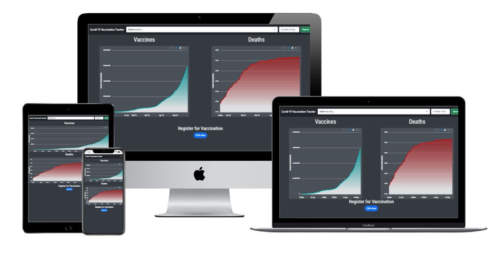
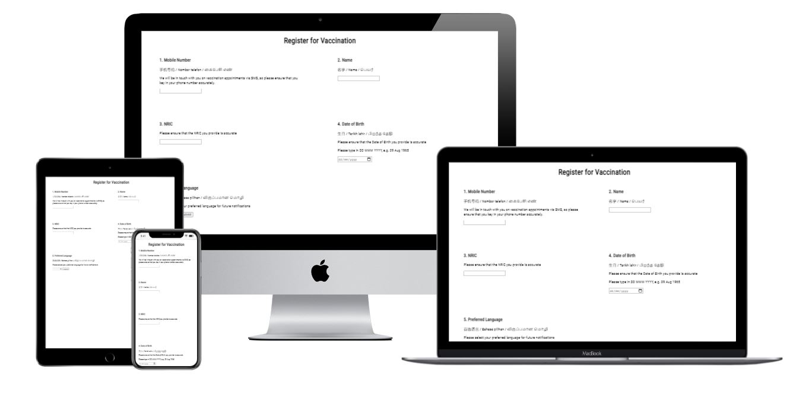

# Covid-19 Vaccination Timeline Data Visualization

### Context:
* I am presenting a comparison on the relationship between vaccinations and deaths.

### User and Organisational Goals:
* User: To allow users to learn about the advantages of vaccination, and prompt them to register for vaccination.
* Organisation: To educate users who are hesitant about vaccination.

### Project URL
* https://eloquent-cori-638199.netlify.app/

### Why the Project Should Exist
* The project should exist to address vaccine hesitancy.

### UX/UI:
* User story: As a user, I am afraid to register for the Covid-19 vaccination due to claims of people dying after taking the vaccination. I want to garner more information about the actual statistics of deaths from the disease, since the time the vaccinations have been rolled out. I can search for different countries, and compare the number of vaccinations that have been administered, versus the historical count for the deaths from covid-19. If I can visually see that an increasing number of vaccinations results in a flattening of the death cases, I can make a more informed decision about whether or not to get myself vaccinated.
* Organization's goals: As an organization, I want to present to the user relevant and convincing information, so as to convince the user to register for vaccination.
* Wireframes:

* Five planes of UI/UX: For the graphs, I decided to go with red for deaths as it is a colour that is often associated with warnings, and blue for the vaccinations because I want to user to associate vaccination with a feeling of calmness and not something to be afraid of. The button to visit the register page stands out, and it is a call to action to the user to click it. The colour of the entire index page is dark, because this is a matter to be taken seriously.

### Features
* User is able to search for specific country from a dropdown menu, and limit the day range (anywhere between 'all' to the current day, i.e. '1')). Once both items are entered, and they click on the search button, the graph will update to display what they have searched for.
* There is a zoom function on the graph, but the search will be more specific.
* The graphs display information that is obtained from APIs, therefore, there is sometimes a delay in actual cases for the day(s). There is sometimes also discrepencies in the reporting of the numbers for the various countries, so the information might not be accurate due to this.
* User is able to be redirected to a mock registration form.
* The graphs take up the entire width on small and medium sized devices. On large devices, both graphs will sit on one row.

### Testing
* Select any 3 countries from the dropdown, and enter day range, e.g. 'all', or a number, then click search to see the graph load up new information.

### Deployment
1. Sign up for an account at Netlify
2. Commit and push your code to Github
3. Create a new site from Git
4. Choose Continuous Deployment
5. Select or search for your repo
6. Wait for deployment to be done

### Dependencies
* Bootstrap
* ApexCharts
* Google Fonts

### Bugs
* Synchronization for graphs don't seem to be working well, the dates may not necessarily correspond.
* Able to update options for vaccines chart on loading only, for both x and y axis, but unable to update for deaths chart on x-axis, and still trying to find out why.
* Want to be able to have graph dynamically update with country names after user clicks search.